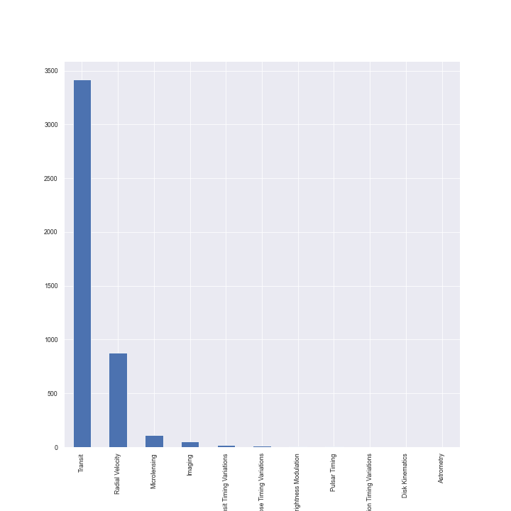
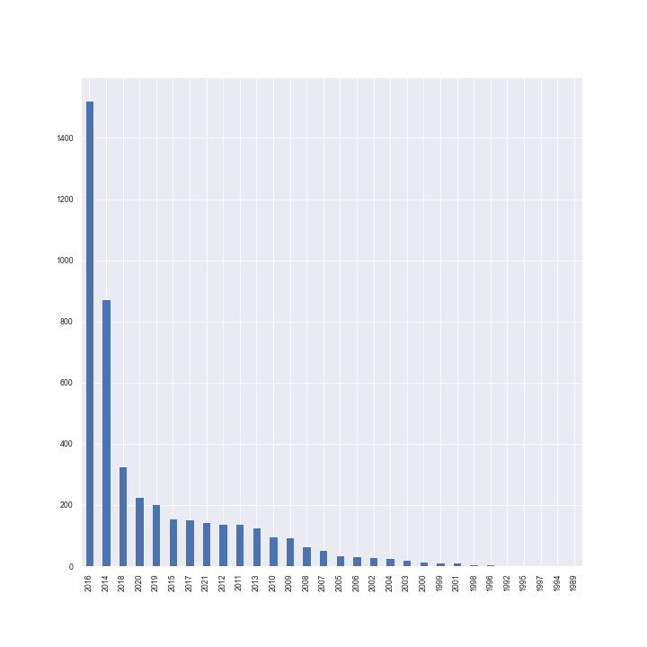

# NASA-API

Este proyecto tuvo como finalidad el extraer datos usando la [API](https://api.nasa.gov) de la NASA.

De allí se utilizo la base de datos de exoplanetas, de la cual se utilizo la tabla de exoplanetas detectados con la tecnica de microlensing y la tabla de Planetary Systems Composite que contiene todos los exoplanetas detectados por diferentes tecnicas.

De la tabla microlensing se seleccionaron los siguientes atributos: 

- **pl_name:** Planet Name (Planet name)
- **rastr:** RA (Right ascension of the microlensing event, in sexagesimal format
- **decstr:** Declination of the microlensing event, in sexagesimal format
- **pl_masse:** Mass of planet, in Earth masses
- **pl_massj:** Planet Mass (Mass of planet, in Jupiter masses)
- **pl_orbsmax** Planet-star Projected Semi-major Axis, unidad = Astronomical unit (au) 
- **sy_dist:** Lens Distance, unit = Parsec (pc)
- **ml_dists:** Source Distance, unit = Parsec (pc)
- **ml_xtimeein:** Einstein Crossing Time, unit=days 
- **ml_massratio:** Planet-star Mass Ratio (10^-4)
- **ml_magis:** Source I-band unit = mag 
- **ml_radeinang:** Angular Einstein Radius, unit = mas 

Se puede visitar la siguiente [documentación](https://exoplanetarchive.ipac.caltech.edu/docs/microlensing-column-mapping.pdf) para una explicación de el significado de cada una de las columnas y lo que representa:

Se aplicaron metodos de data cleaning y data wrangling en ambos dataframes. Luego se combino un subset de planetas de microlensing de Planetary System Composite y se hizo un merge con la tabla de microlesing con la finalidad de obtener 
valores para las columnas de la masa del planeta comparada con la masa de la tierra y de jupiter ya que no se contaba con suficiente información para estás en el dataframe original. 

Obteniendo un total de tres dataframes (microlensing, plaetary composite systems y merge).

---
## Tabla de Microlensing

| Name  | Description |
| ------------- | ------------- |
| planet_name	  | Planet Name. |
| ra_event	  | Right ascension of the microlensing event. |
| dec_event | Declination of the microlensing event. |
| earth_massses	 | Mass of planet, in Earth masses.  |
| jupiter_masses | Mass of planet, in Jupiter masses. |
| planet_orbmax  |Planet-star Projected Semi-major Axis. |
| lens_distance | Lens Distance, unit = Parsec (pc). |
| source_distance | Source Distance, unit = Parsec (pc). |
| einstein_cross_time | Einstein Crossing Time, unit=days.  |
| source_mag  | Source I-band unit = mag
| planet_star_mass_ratio  | Planet-star Mass Ratio (10^-4). |
| angular_einstein_radius | Angular Einstein Radius, unit = mas. |
| lens_distance_ly | Lens Distance, unit = light years (ly). |
| source_distance_ly  | Source Distance, unit = light years (ly). |

## Tabla de Planetary Systems Composite

| Name  | Description |
| ------------- | ------------- |
| planet_name | Planet Name |
| hostname | Stellar name |
| sys_num_stars | Number of Stars |
| sys_num_planet | Number of Planets |
| discovery_method | Discovery Method |
| discovery_year | Discovery Year |
| discovery_telescope | Discovery Telescope |
| orbital_period | Orbital Period, unit=days |
| orbital_semi_major | Orbit Semi-Major Axis, unit = au |
| planet_radius_earth | Planet Radius (Earth Radius) |
| planet_radius_jupiter | Planet Radius (Jupiter Radius) |
| planet_mass_earth | Planet Mass (Earth Mass) |
| planet_mass_jupiter | Planet Mass (Jupiter Mass) |
| eccentricity | Eccentricity |
| stellar_eff_temp | Stellar Effective Temperature unit=K |
| stellar_radius | Stellar Radius (Solar Radius) |
| stellar_mass | Stellar Mass |
| dist_system | Distance, unit = pc |
| dist_system_ly | Distance, unit = ly |

--- 

Del análisis de la data se obtuvo que el metodo que predomina para el descubrimiento de exoplanetas en está data es el método del tránsito:

El planeta con el período orbital más largo es [COCONUTS-2 b](https://exoplanets.nasa.gov/exoplanet-catalog/7945/coconuts-2-b/)

El planeta con el período orbital más corto es [PSR J1719-1438 b](https://exoplanets.nasa.gov/exoplanet-catalog/7138/psr-j1719-1438-b/)

También se obtuvo la frecuencia de descubrimientos por año:

En el notebook Nasa API visualization están todas las gráficas del proyecto de visualización de datos. En el notebook NASA API se puede ver todo el procedimiento para la extracción y transformación de los datos.

Para este proyecto se hicieron visualizaciones tanto en python utilizando la librería seaborn así como en tableau.

En el siguiente enlace puede observar el libro de visualizaciones de tableau.

https://public.tableau.com/app/profile/mariangel4686/viz/DataViz_16325145176620/Dip10?publish=yes
